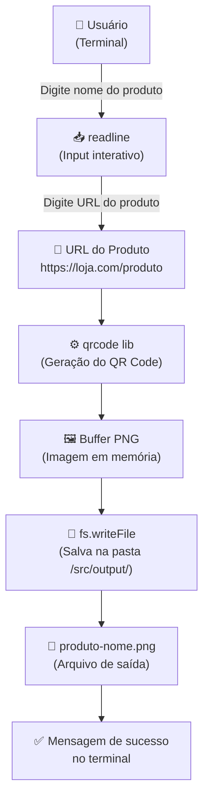
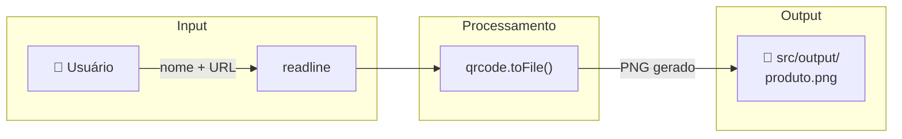
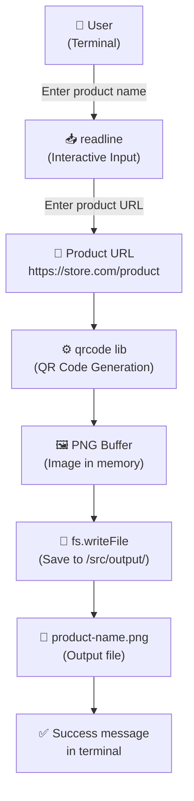
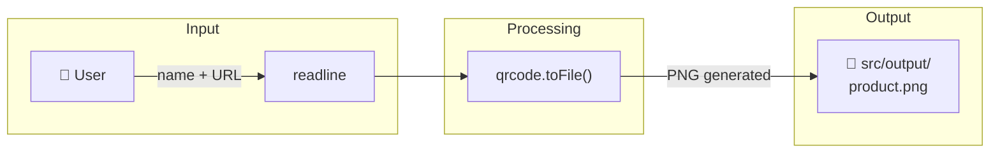

# Gerador de QR Codes para E-commerce 🛒📦


[](https://nodejs.org/)
[](https://www.npmjs.com/package/qrcode)
[](https://opensource.org/licenses/MIT)


## 🇧🇷 Português

**Bem-vindo ao Gerador de QR Codes personalizado!** Este projeto foi desenvolvido para facilitar a criação de QR Codes de links de produtos para e-commerces de forma prática e rápida, utilizando Node.js no terminal. Agora com uma funcionalidade extra: o QR Code é salvo com o nome do produto, tornando o gerenciamento muito mais organizado!

### 🚀 Como usar

1.  Clone o repositório:
    ```bash
    git clone https://github.com/galafis/Criando-um-Gerador-de-QR-Codes-para-E-commerces-com-Node.js.git
    ```
2.  Navegue até a pasta do projeto:
    ```bash
    cd Criando-um-Gerador-de-QR-Codes-para-E-commerces-com-Node.js
    ```
3.  Instale as dependências:
    ```bash
    npm install
    ```
4.  Inicie o gerador:
    ```bash
    npm start
    ```
5.  Siga as instruções no terminal para digitar o NOME e o LINK do produto.

O QR Code será salvo automaticamente na pasta `/src/output/`, nomeado conforme o produto.

### 🛍️ Funcionalidades

*   Gera QR Codes a partir de links de produtos.
*   Salva os QR Codes como imagens `.png` com o nome do produto.
*   Mensagens amigáveis no terminal.
*   Pasta `src/output` automática para armazenar seus QR Codes.

### 📦 Tecnologias usadas

*   Node.js
*   `qrcode` (biblioteca para geração de QR Codes)
*   `readline` (módulo nativo do Node.js para interação com o terminal)

### 🏗️ Arquitetura do Projeto

O diagrama abaixo ilustra a arquitetura do gerador de QR Codes:





### 🧪 Testes

Para executar os testes unitários do projeto, utilize o comando:

```bash
npm test
```

### 📄 Licença

Este projeto está licenciado sob a Licença MIT. Veja o arquivo [LICENSE](LICENSE) para mais detalhes.

### 👨‍💻 Autor

**Gabriel Demetrios Lafis**

---

## 🇬🇧 English

**Welcome to the custom QR Code Generator!** This project was developed to facilitate the practical and quick creation of QR Codes for e-commerce product links using Node.js in the terminal. Now with an extra feature: the QR Code is saved with the product name, making management much more organized!

### 🚀 How to Use

1.  Clone the repository:
    ```bash
    git clone https://github.com/galafis/Criando-um-Gerador-de-QR-Codes-para-E-commerces-com-Node.js.git
    ```
2.  Navigate to the project folder:
    ```bash
    cd Criando-um-Gerador-de-QR-Codes-para-E-commerces-com-Node.js
    ```
3.  Install dependencies:
    ```bash
    npm install
    ```
4.  Start the generator:
    ```bash
    npm start
    ```
5.  Follow the terminal instructions to enter the product NAME and LINK.

The QR Code will be automatically saved in the `/src/output/` folder, named after the product.

### 🛍️ Features

*   Generates QR Codes from product links.
*   Saves QR Codes as `.png` images with the product name.
*   User-friendly messages in the terminal.
*   Automatic `src/output` folder to store your QR Codes.

### 📦 Technologies Used

*   Node.js
*   `qrcode` (library for QR Code generation)
*   `readline` (Node.js native module for terminal interaction)

### 🏗️ Project Architecture

The diagram below illustrates the QR Code generator architecture:





### 🧪 Tests

To run the project's unit tests, use the command:

```bash
npm test
```

### 📄 License

This project is licensed under the MIT License. See the [LICENSE](LICENSE) file for more details.

### 👨‍💻 Autor

**Gabriel Demetrios Lafis**


---

## English

### Overview

Gerador de QR Codes para E-commerce 🛒📦 - A project built with Node.js, developed by Gabriel Demetrios Lafis as part of professional portfolio and continuous learning in Data Science and Software Engineering.

### Key Features

This project demonstrates practical application of modern development concepts including clean code architecture, responsive design patterns, and industry-standard best practices. The implementation showcases real-world problem solving with production-ready code quality.

### How to Run

1. Clone the repository:
   ```bash
   git clone https://github.com/galafis/Criando-um-Gerador-de-QR-Codes-para-E-commerces-com-Node.js.git
   ```
2. Follow the setup instructions in the Portuguese section above.

### License

This project is licensed under the MIT License. See the [LICENSE](LICENSE) file for details.

---

Developed by [Gabriel Demetrios Lafis](https://github.com/galafis)
